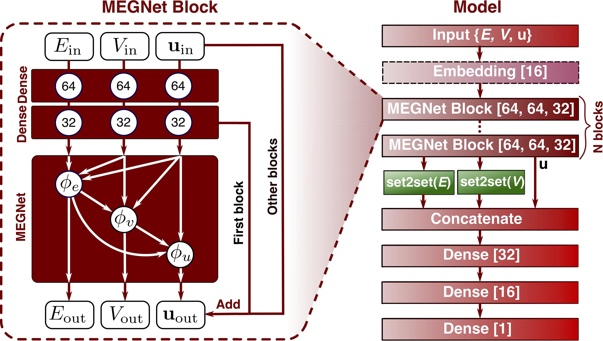

[]()
[](https://travis-ci.org/materialsvirtuallab/megnet)
[](https://coveralls.io/github/materialsvirtuallab/megnet?branch=master&service=github)
[](https://pepy.tech/project/megnet)
[](https://github.com/materialsvirtuallab/megnet/workflows/Linting/badge.svg)
[](https://github.com/materialsvirtuallab/megnet/workflows/Testing%20-%20main/badge.svg)
# Table of Contents
* [Introduction](#introduction)
* [MEGNet Framework](#megnet-framework)
* [Installation](#installation)
* [Usage](#usage)
* [Datasets](#datasets)
* [Implementation details](#implementation-details)
* [Computing requirements](#computing-requirements)
* [Known limitations](#limitations)
* [Contributors](#contributors)
* [References](#references)

<a name="introduction"></a>
# Introduction

This repository represents the efforts of the [Materials Virtual Lab](http://www.materialsvirtuallab.org) 
in developing graph networks for machine learning in materials science. It is a 
work in progress and the models we have developed thus far are only based on 
our best efforts. We welcome efforts by anyone to build and test models using 
our code and data, all of which are publicly available. Any comments or 
suggestions are also welcome (please post on the Github Issues page.)

A web app using our pre-trained MEGNet models for property prediction in 
crystals is available at http://megnet.crystals.ai.

<a name="megnet-framework"></a>
# MEGNet framework

The MatErials Graph Network (MEGNet) is an implementation of DeepMind's graph 
networks[1] for universal machine learning in materials science. We have 
demonstrated its success in achieving very low prediction errors in a broad 
array of properties in both molecules and crystals (see 
["Graph Networks as a Universal Machine Learning Framework for Molecules and Crystals"](https://doi.org/10.1021/acs.chemmater.9b01294)[2]). New releases have included our recent work on multi-fidelity materials property modeling (See ["Multi-fidelity Graph Networks for Deep Learning the Experimental Properties of Ordered and Disordered Materials"](https://arxiv.org/abs/2005.04338)[3]).

Briefly, Figure 1 shows the sequential update steps of the graph network, 
whereby bonds, atoms, and global state attributes are updated using information
from each other, generating an output graph.


<div align='center'><strong>Figure 1. The graph network update function.</strong></div>

Figure 2 shows the overall schematic of the MEGNet. Each graph network module 
is preceded by two multi-layer perceptrons (known as Dense layers in Keras 
terminology), constituting a MEGNet block. Multiple MEGNet blocks can be 
stacked, allowing for information flow across greater spatial distances. The 
number of blocks required depend on the range of interactions necessary to 
predict a target property. In the final step, a `set2set` is used to map the 
output to a scalar/vector property.


<div align='center'><strong>Figure 2. Schematic of MatErials Graph Network.</strong></div>

<a name="installation"></a>
# Installation

Megnet can be installed via pip for the latest stable version:

```bash
pip install megnet
```

For the latest dev version, please clone this repo and install using:

```bash
python setup.py develop
```

<a name="usage"></a>
# Usage

Our current implementation supports a variety of use cases for users with 
different requirements and experience with deep learning. Please also visit 
the [notebooks directory](notebooks) for Jupyter notebooks with more detailed code examples.

## Using pre-built models

In our work, we have already built MEGNet models for the QM9 data set and 
Materials Project dataset. These models are provided as serialized HDF5+JSON 
files. Users who are purely interested in using these models for prediction 
can quickly load and use them via the convenient `MEGNetModel.from_file`
method. These models are available in the `mvl_models` folder of this repo. 
The following models are available:

* QM9 molecule data:
    - HOMO: Highest occupied molecular orbital energy
    - LUMO: Lowest unoccupied molecular orbital energy
    - Gap: energy gap
    - ZPVE: zero point vibrational energy
    - µ: dipole moment
    - α: isotropic polarizability
    - \<R2\>: electronic spatial extent
    - U0: internal energy at 0 K
    - U: internal energy at 298 K
    - H: enthalpy at 298 K
    - G: Gibbs free energy at 298 K
    - Cv: heat capacity at 298 K
    - ω1: highest vibrational frequency.
* Materials Project data:
    - Formation energy from the elements
    - Band gap
    - Log 10 of Bulk Modulus (K)
    - Log 10 of Shear Modulus (G)

The MAEs on the various models are given below:

### Performance of QM9 MEGNet-Simple models

| Property | Units      | MAE   |
|----------|------------|-------|
| HOMO     | eV         | 0.043 |
| LUMO     | eV         | 0.044 |
| Gap      | eV         | 0.066 |
| ZPVE     | meV        | 1.43  |
| µ        | Debye      | 0.05  |
| α        | Bohr^3     | 0.081 |
| \<R2\>   | Bohr^2     | 0.302 |
| U0       | eV         | 0.012 |
| U        | eV         | 0.013 |
| H        | eV         | 0.012 |
| G        | eV         | 0.012 |
| Cv       | cal/(molK) | 0.029 |
| ω1       | cm^-1      | 1.18  |

### Performance of MP-2018.6.1

| Property | Units      | MAE   |
|----------|------------|-------|
| Ef       | eV/atom    | 0.028 |
| Eg       | eV         | 0.33  |
| K_VRH    | log10(GPa) | 0.050 |
| G_VRH    | log10(GPa) | 0.079 |

### Performance of MP-2019.4.1

| Property | Units      | MAE   |
|----------|------------|-------|
| Ef       | eV/atom    | 0.026 |
| Efermi   | eV         | 0.288 |

New models will be added as they are developed in the [mvl_models](mvl_models)
folder. Each folder contains a summary of model details and benchmarks. For
the initial models and bencharmks comparison to previous models, 
please refer to ["Graph Networks as a Universal Machine Learning Framework for Molecules and Crystals"](https://doi.org/10.1021/acs.chemmater.9b01294)[2]. 

Below is an example of crystal model usage:

```python
from megnet.utils.models import load_model
from pymatgen import Structure, Lattice

# load a model in megnet.utils.models.AVAILABLE_MODELS
model = load_model("logK_MP_2018") 

# We can construct a structure using pymatgen
structure = Structure(Lattice.cubic(3.167), 
            ['Mo', 'Mo'], [[0, 0, 0], [0.5, 0.5, 0.5]])


# Use the model to predict bulk modulus K. Note that the model is trained on
# log10 K. So a conversion is necessary.
predicted_K = 10 ** model.predict_structure(structure).ravel()
print('The predicted K for {} is {} GPa'.format(structure.formula, predicted_K[0]))

```
A full example is in [notebooks/crystal_example.ipynb](notebooks/crystal_example.ipynb). 

For molecular models, we have an example in 
[notebooks/qm9_pretrained.ipynb](notebooks/qm9_pretrained.ipynb). 
We support prediction directly from a pymatgen molecule object. With a few more
lines of code, the model can predict from `SMILES` representation of molecules,
as shown in the example. It is also straightforward to load a `xyz` molecule 
file with pymatgen and predict the properties using the models. However, the 
users are generally not advised to use the `qm9` molecule models for other 
molecules outside the `qm9` datasets, since the training data coverage is 
limited.

Below is an example of predicting the "HOMO" of a smiles representation

```python
from megnet.utils.molecule import get_pmg_mol_from_smiles
from megnet.models import MEGNetModel

# same model API for molecule and crystals, you can also use the load_model method 
# as in previous example
model = MEGNetModel.from_file('mvl_models/qm9-2018.6.1/HOMO.hdf5')
# Need to convert SMILES into pymatgen Molecule
mol = get_pmg_mol_from_smiles("C")
model.predict_structure(mol)
```

## Training a new MEGNetModel from structures

For users who wish to build a new model from a set of crystal structures with 
corresponding properties, there is a convenient `MEGNetModel` class for setting
up and training the model. By default, the number of MEGNet blocks is 3 and the
atomic number Z is used as the only node feature (with embedding).

```python
from megnet.models import MEGNetModel
from megnet.data.crystal import CrystalGraph
import numpy as np

nfeat_bond = 10
r_cutoff = 5
gaussian_centers = np.linspace(0, r_cutoff + 1, nfeat_bond)
gaussian_width = 0.5
graph_converter = CrystalGraph(cutoff=r_cutoff)
model = MEGNetModel(graph_converter=graph_converter, centers=gaussian_centers, width=gaussian_width)

# Model training
# Here, `structures` is a list of pymatgen Structure objects.
# `targets` is a corresponding list of properties.
model.train(structures, targets, epochs=10)

# Predict the property of a new structure
pred_target = model.predict_structure(new_structure)
```
Note that for realistic models, the `nfeat_bond` can be set to 100 and `epochs` can be 1000. 
In some cases, some structures within the training pool may not be valid (containing isolated atoms),
then one needs to use `train_from_graphs` method by training only on the valid graphs. 

Following the previous example, 
```python
model = MEGNetModel(graph_converter=graph_converter, centers=gaussian_centers, width=gaussian_width)
graphs_valid = []
targets_valid = []
structures_invalid = []
for s, p in zip(structures, targets):
    try:
        graph = model.graph_converter.convert(s)
        graphs_valid.append(graph)
        targets_valid.append(p)
    except:
        structures_invalid.append(s)

# train the model using valid graphs and targets
model.train_from_graphs(graphs_valid, targets_valid)
```
For model details and benchmarks, please refer to ["Graph Networks as a Universal Machine Learning Framework for Molecules and Crystals"](https://doi.org/10.1021/acs.chemmater.9b01294)[2]


### Training multi-fidelity graph networks

Please see the folder `multifidelity` for specific examples.

### Pre-trained elemental embeddings

A key finding of our work is that element embeddings from trained formation 
energy models encode useful chemical information that can be transferred 
learned to develop models with smaller datasets (e.g. elastic constants, 
band gaps), with better converegence and lower errors. These embeddings are 
also potentially useful in developing other ML models and applications. These 
embeddings have been made available via the following code:

```python
from megnet.data.crystal import get_elemental_embeddings

el_embeddings = get_elemental_embeddings()
```

An example of transfer learning using the elemental embedding from formation 
energy to other models, please check [notebooks/transfer_learning.ipynb](notebooks/transfer_learning.ipynb).

## Customized Graph Network Models

For users who are familiar with deep learning and Keras and wish to build 
customized graph network based models, the following example outlines how a 
custom model can be constructed from `MEGNetLayer`, which is essentially our 
implementation of the graph network using neural networks:

```python
from tensorflow.keras.layers import Input, Dense
from tensorflow.keras.models import Model
from megnet.layers import MEGNetLayer, Set2Set

n_atom_feature= 20
n_bond_feature = 10
n_global_feature = 2

# Define model inputs
int32 = 'int32'
x1 = Input(shape=(None, n_atom_feature)) # atom feature placeholder
x2 = Input(shape=(None, n_bond_feature)) # bond feature placeholder
x3 = Input(shape=(None, n_global_feature)) # global feature placeholder
x4 = Input(shape=(None,), dtype=int32) # bond index1 placeholder
x5 = Input(shape=(None,), dtype=int32) # bond index2 placeholder
x6 = Input(shape=(None,), dtype=int32) # atom_ind placeholder
x7 = Input(shape=(None,), dtype=int32) # bond_ind placeholder
xs = [x1, x2, x3, x4, x5, x6, x7]

# Pass the inputs to the MEGNetLayer layer
# Here the list are the hidden units + the output unit, 
# you can have others like [n1] or [n1, n2, n3 ...] if you want. 
out = MEGNetLayer([32, 16], [32, 16], [32, 16], pool_method='mean', activation='relu')(xs)

# the output is a tuple of new graphs V, E and u
# Since u is a per-structure quantity, 
# we can directly use it to predict per-structure property
out = Dense(1)(out[2])

# Set up the model and compile it!
model = Model(inputs=xs, outputs=out)
model.compile(loss='mse', optimizer='adam')
```

With less than 20 lines of code, you have built a graph network model that is 
ready for materials property prediction!

<a name="implementation-details"></a>
# Implementation details

Graph networks[1] are a superclass of graph-based neural networks. There are a
few innovations compared to conventional graph-based neural neworks. 

* Global state attributes are added to the node/edge graph representation. 
  These features work as a portal for structure-independent features such as 
  temperature, pressure etc and also are an information exchange placeholder 
  that facilitates information passing across longer spatial domains. 
* The update function involves the message interchange among all three levels 
  of information, i.e., the node, bond and state information. It is therefore a
  highly general model.

The `MEGNet` model implements two major components: (a) the `graph network`
layer and (b) the `set2set` layer.[4] The layers are based on 
[keras](https://keras.io/) API and is thus compatible with other keras modules. 

Different crystals/molecules have different number of atoms. Therefore it is 
impossible to use data batches without padding the structures to make them 
uniform in atom number. `MEGNet` takes a different approach. Instead of making 
structure batches, we assemble many structures into one giant structure, and 
this structure has a vector output with each entry being the target value for 
the corresponding structure. Therefore, the batch number is always 1. 

Assuming a structure has N atoms and M bonds, a structure graph is represented 
as **V** (nodes/vertices, representing atoms), **E** (edges, representing bonds)
and **u** (global state vector). **V** is a N\*Nv matrix. **E** comprises of a 
M\*Nm matrix for the bond attributes and index pairs (rk, sk) for atoms 
connected by each bond. **u** is a vector with length Nu. We vectorize rk and 
sk to form `index1` and `index2`, both are vectors with length M. In summary, 
the graph is a data structure with **V** (N\*Nv), **E** (M\*Nm), **u** 
(Nu, ), `index1` (M, ) and `index2` (M, ). 

We then assemble several structures together. For **V**, we directly append the
atomic attributes from all structures, forming a matrix (1\*N'\*Nv), where 
N' > N. To indicate the belongingness of each atom attribute vector, we use a 
`atom_ind` vector. For example if `N'=5` and the first 3 atoms belongs to the 
first structure and the remainings the second structure, our `atom_ind` vector 
would be `[0, 0, 0, 1, 1]`. For the bond attribute, we perform the same 
appending method, and use `bond_ind` vector to indicate the bond belongingness. 
For `index1` and `index2`, we need to shift the integer values. For example, 
if `index1` and `index2` are `[0, 0, 1, 1]` and `[1, 1, 0, 0]` for structure 1
and are `[0, 0, 1, 1]` and `[1, 1, 0, 0]` for structure two. The assembled
indices are `[0, 0, 1, 1, 2, 2, 3, 3]` and `[1, 1, 0, 0, 3, 3, 2, 2]`. Finally,
**u** expands a new dimension to take into account of the number of structures,
and becomes a 1\*Ng\*Nu tensor, where Ng is the number of structures. `1` is 
added as the first dimension of all inputs because we fixed the batch size to
be 1 (1 giant graph) to comply the keras inputs requirements. 

In summary the inputs for the model is **V** (1\*N'\*Nv), **E** (1\*M'\*Nm), 
**u** (1\*Ng\*Nu), `index1` (1\*M'), `index2` (1\*M'), `atom_ind` (1\*N'), and
`bond_ind` (1\*M'). For Z-only atomic features, **V** is a (1\*N') vector.

<a name="datasets"></a>
# Data sets

To aid others in reproducing (and improving on) our results, we have provided 
our MP-crystals-2018.6.1 crystal data set via [figshare](https://figshare.com/articles/Graphs_of_materials_project/7451351)[5]. 
The MP-crystals-2018.6.1 data set comprises the DFT-computed energies and
band gaps of 69,640 crystals from the [Materials Project](http://www.materialsproject.org)
obtained via the [Python Materials Genomics (pymatgen)](http://pymatgen.org)
interface to the Materials Application Programming Interface (API)[6] on 
June 1, 2018. The crystal graphs were constructed using a radius cut-off of 4 
angstroms. Using this cut-off, 69,239 crystals do not form isolated atoms and 
are used in the models. A subset of 5,830 structures have elasticity data that 
do not have calculation warnings and will be used for elasticity models.

The molecule data set used in this work is the QM9 data set 30 processed by
Faber et al.[7] It contains the B3LYP/6-31G(2df,p)-level DFT calculation
results on 130,462 small organic molecules containing up to 9 heavy atoms.

<a name="computing-requirements"></a>
# Computing requirements

Training: It should be noted that training MEGNet models, like other deep 
learning models, is fairly computationally intensive with large datasets. In 
our work, we use dedicated GPU resources to train MEGNet models with 100,000
crystals/molecules. It is recommended that you do the same.

Prediction: Once trained, prediction using MEGNet models are fairly cheap. 
For example, the http://megnet.crystals.ai web app runs on a single hobby dyno
on Heroku and provides the prediction for any crystal within seconds.

<a name="limitations"></a>
# Known limitations

- `isolated atoms` error. This error occurs when using the given cutoff in the model (4A for
2018 models and 5A for 2019 models), the crystal structure contains isolated atoms, i.e., 
no neighboring atoms are within the distance of `cutoff`. Most of the time, we can just 
discard the structure, since we found that those structures tend to have a high energy above 
hull (less stable). If you think this error is an essential issue for a particular problem, 
please feel free to email us and we will consider releasing a new model with increased cutoff. 

<a name="contributors"></a>
# Contributors
1. Chi Chen from the Materials Virtual Lab is the lead developer of MEGNet.
2. Shyue Ping Ong and other members of the Materials Virtual Lab contributes to general improvements
   of MEGNet and its applications.
3. Logan Ward has made extensive contributions, especially to the development of molecular graph 
   portions of MEGNet.

<a name="references"></a>
# References

1. Battaglia, P. W.; Hamrick, J. B.; Bapst, V.; Sanchez-Gonzalez, A.; 
   Zambaldi, V.; Malinowski, M.; Tacchetti, A.; Raposo, D.; Santoro, A.; 
   Faulkner, R.; et al. Relational inductive biases, deep learning, and graph 
   networks. 2018, 1–38. [arXiv:1806.01261](https://arxiv.org/abs/1806.01261)
2. Chen, C.; Ye, W.; Zuo, Y.; Zheng, C.; Ong, S. P. Graph Networks as a 
   Universal Machine Learning Framework for Molecules and Crystals. Chemistry 
   of Materials 2019, 31(9), 3564-3572. 
   [doi:10.1021/acs.chemmater.9b01294](https://doi.org/10.1021/acs.chemmater.9b01294)
3. Chen, C.; Zuo, Y.; Ye, W.; Li, X.G.; Ong, S. P. Multi-fidelity Graph Networks 
   for Machine Learning the Experimental Properties of Ordered and Disordered Materials.
   2020, [arXiv:2005.04338](https://arxiv.org/abs/2005.04338).
4. Vinyals, O.; Bengio, S.; Kudlur, M. Order Matters: Sequence to sequence for 
   sets. 2015, arXiv preprint. [arXiv:1511.06391](https://arxiv.org/abs/1511.06391)
5. https://figshare.com/articles/Graphs_of_materials_project/7451351
6. Ong, S. P.; Cholia, S.; Jain, A.; Brafman, M.; Gunter, D.; Ceder, G.; 
   Persson, K. A. The Materials Application Programming Interface (API): A 
   simple, flexible and efficient API for materials data based on
   REpresentational State Transfer (REST) principles. Comput. Mater. Sci. 2015, 
   97, 209–215 DOI: [10.1016/j.commatsci.2014.10.037](http://dx.doi.org/10.1016/j.commatsci.2014.10.037).
7. Faber, F. A.; Hutchison, L.; Huang, B.; Gilmer, J.; Schoenholz, S. S.; 
   Dahl, G. E.; Vinyals, O.; Kearnes, S.; Riley, P. F.; von Lilienfeld, O. A. 
   Prediction errors of molecular machine learning models lower than hybrid DFT 
   error. Journal of Chemical Theory and Computation 2017, 13, 5255–5264. 
   DOI: [10.1021/acs.jctc.7b00577](http://dx.doi.org/10.1021/acs.jctc.7b00577)
